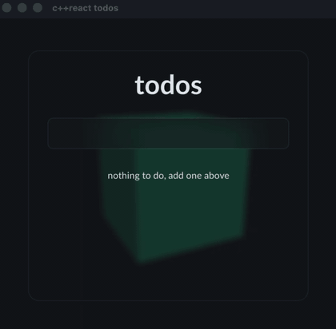

The last few days I built a small library, and I want to write down why.

I am working on a game in Unreal Engine 5, in C++. At some point you need a user interface, and if
you have ever built one in C++ around OpenGL, you know the options are thin. I come from the web, I am
used to React and CSS, and I missed them more than I expected. I tried a few things and none of them
felt right.

Then I found [RmlUi](https://github.com/mikke89/RmlUi). It is an HTML and CSS like renderer for C++
that draws through OpenGL and a few other backends. I was hooked pretty fast. It gave me the document
and the styling I know from the browser, right inside my C++ code.

So I wrote my own Slate backend and got RmlUi running inside Unreal Engine. And because it is plain
portable C++, I could compile the same UI to the web with wasm and draw it with three.js. The same
interface now runs in the engine and in the browser, from one codebase.

But one thing was still missing. RmlUi gives you the tree and the styling, not the way I like to build
UIs. No components, no hooks, no state that just updates the parts that changed. I missed my React.

So I built it. c++react is the React model in C++: function components, hooks, and a virtual DOM that
only touches what changed. It does not render on its own. You point it at a renderer and it drives
that, so the same components run on RmlUi in the engine and on the web.

It is early and it is open source. If you want to poke at it or break it, it is here:
[github.com/geforcefan/cppreact](https://github.com/geforcefan/cppreact).
